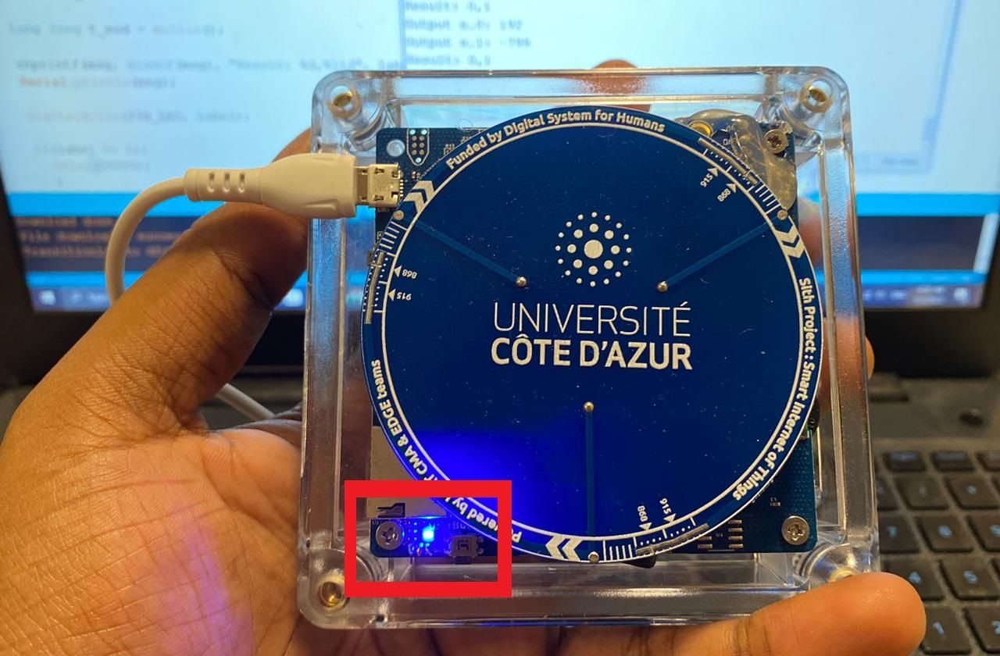

# Edge AI: Optimized CNN for Edge Inference on STM32

The steps involved in this projects are the collection of the accelerometer sensor’s data from the RFThings-AI Dev Kit board, annotation of the collected data using the microAI GUI software, followed by preprocessing and training a convolutional neural network (CNN) using the collected data with the Tensorflow library. The purpose of the CNN is to process and analyze the accelerometer data, allowing us to successfully make predictions of a specific pattern. One of the key aspects of this project is converting the trained model into C code using microAI framework. This step enables the implementation of real-time prediction on the same board, showcasing the practical applications of AI in IoT. Finally, the model is used to infer results in real-time.

---

### RFThings-AI Dev Kit board

Board Specifications: RFThings-AI Dev Kit board used in our project has an STM32-based Microcontroller that uses an ARM Cortex M4 architecture and runs at a frequency of 80 MHz. With 1 MB Flash and 128 KB SRAM, this board provided us with enough resources to work with.

---

### Fixed-Point for Quantization

Fixed-Point for Quantization: To optimize memory usage and improve inference speed, we employed fixed-point quantization. Fixed-point quantization is better than default floating-point representation for running on edge devices like the STM32 because it offers several advantages such as reduced memory usage and improved inference speed. By reducing the precision of weights and activations, the model size becomes smaller, allowing it to fit within the limited resources of the edge device. Additionally, the computations are faster due to the simplified arithmetic operations involved in fixed-point calculations. This makes it ideal for real-time prediction on edge devices with limited processing power and memory capacity.